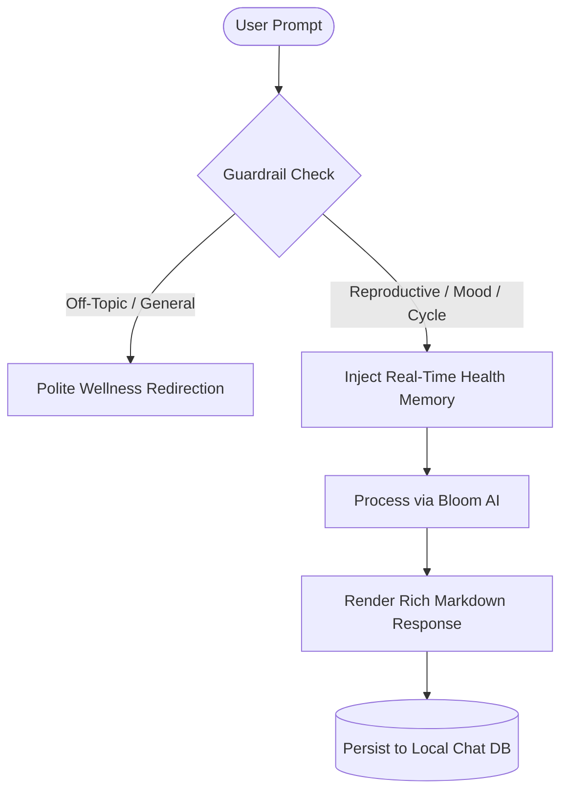

# Bloom (🌸) — Private, Zero-Knowledge Reproductive Health Platform

[](LICENSE)
[](https://flutter.dev)
[](https://dart.dev)
[](https://workers.cloudflare.com)
[](#security--cryptography-architecture)
[](#continuous-verification--quality-assurance)

**Bloom** is an enterprise-grade, privacy-first menstrual cycle tracking and couples' reproductive wellness application. Designed from the ground up on a **Local-First, Zero-Knowledge architecture**, Bloom ensures that personal health metrics, cycle history, daily physical symptoms, and intimate notes remain strictly encrypted on the user's device. 

Cross-device partner synchronization is powered by client-side **AES-256 encryption** and routed through a globally distributed, stateless **Cloudflare Workers & Durable Objects** WebSocket relay with zero persistent cloud data retention.

---

## 📑 Table of Contents

1. [Key Features](#-key-features)
2. [Security & Cryptography Architecture](#-security--cryptography-architecture)
3. [Bloom AI Engine & Clinical Guardrails](#-bloom-ai-engine--clinical-guardrails)
4. [System Architecture & Codebase Map](#-system-architecture--codebase-map)
5. [Technology Stack](#-technology-stack)
6. [Getting Started & Local Development](#-getting-started--local-development)
7. [Cloudflare Relay Server Deployment](#-cloudflare-relay-server-deployment)
8. [Production Release Build & Optimization](#-production-release-build--optimization)
9. [Continuous Verification & Quality Assurance](#-continuous-verification--quality-assurance)
10. [License & Disclaimer](#-license--disclaimer)

---

## 🌟 Key Features

### 1. Intelligent Cycle & Past Period Management
* **Flexible Period Logging**: Record active cycles or past historical periods with custom start and end date pickers, duration presets (3–7 days), and ongoing flow tracking.
* **Deduplication Engine**: Built-in date-clamping and deduplication logic prevent redundant entries on identical calendar dates.
* **Calendar Date Guard**: Future dates are visually distinguished and disabled to prevent chronological data entry errors while preserving predictive forecasting.
* **Rolling Predictive Engine**: Computes dynamic rolling averages for cycle length, period duration, next expected period, and estimated fertile windows.

### 2. Dedicated Bloom AI Companion
* **On-Device Chat History (CRUD)**: Create new chat sessions, review historical logs, rename conversation titles, and delete specific messages or entire threads with 100% on-device persistence.
* **Rich Markdown Engine**: Clean rendering of bold concepts, structured lists, bullet points, headers, and formatted advice.
* **Strict Clinical Guardrails**: Restricted strictly to reproductive health, menstrual symptoms, hormonal rhythms, PMS, nutrition, and partner empathy. Out-of-scope queries (general tech, math, politics) are politely redirected back to personal health.
* **Real-Time Context Memory**: Automatically injects real-time cycle phase, cycle day, recent symptoms, and rolling baselines into prompt context for hyper-personalized wellness guidance.

### 3. Medical-Grade PDF Export & Sharing
* **Printable Health Report**: Generates formatted, confidential PDF reports containing key health metric cards, chronological cycle history tables, and detailed symptom/mood journals.
* **Cross-Platform Native Sharing**: 1-tap sharing via native operating system share sheets (AirDrop, Email, WhatsApp, Cloud Drive, or PDF Print).

### 4. Zero-Knowledge Partner Sync
* **Ephemeral Peer-to-Peer Relay**: Sync cycle status and health updates with your partner via 6-character mutual pairing codes.
* **Strict Mutual Consent**: Incoming synchronization requests require explicit user authorization before transmitting payloads.
* **Deterministic Conflict Resolution**: Two-way smart merge engine deduplicates records and reconciles modifications without data loss.

---

## 🔐 Security & Cryptography Architecture

```
+-------------------+                                    +-------------------+
|  Primary Device   |                                    |  Partner Device   |
|   (Client A)      |                                    |   (Client B)      |
+---------+---------+                                    +---------+---------+
          |                                                        |
    [1. Data Prep]                                                 |
          |                                                        |
    [2. AES-256 Encrypt]                                           |
    (Key = SHA256(Secret))                                         |
    (Random 16B IV)                                                |
          |                                                        |
          |======== Encrypted Payload (Ciphertext + IV) ==========>|
          |                                                        |
          |             +----------------------------+             |
          |             | Cloudflare Worker & DO     |             |
          +------------>| (Stateless Ephemeral Relay)|<------------+
                        +----------------------------+
                                                                   |
                                                            [3. Decrypt Payload]
                                                            (Match Shared Key)
                                                                   |
                                                            [4. Smart 2-Way Merge]
                                                                   |
                                                            [5. Local JSON Save]
```

* **Client-Side Key Derivation**: Shared secrets derive 256-bit cryptographic keys using `SHA-256`.
* **Symmetric Cipher**: Data is encrypted using `AES-256-CBC` with cryptographically secure random Initialization Vectors (IV) per payload.
* **Zero Cloud Retention**: The Cloudflare Relay server operates as a dumb routing pipe; it never inspects, logs, or stores unencrypted health records.

---

## 🌸 Bloom AI Engine & Clinical Guardrails

Bloom AI is designed to act as an empathetic, scientifically accurate cycle wellness and reproductive health advisor:



* **Topic Scope**: Menstrual phases, ovulation, hormonal health, PMS symptoms, cramp relief, cycle-syncing nutrition, emotional well-being, and intimacy.
* **Guardrail Enforcement**: Prevents off-topic usage by intercepting non-wellness queries and redirecting the user to cycle health.
* **Contextual Prompt Injection**: Seamlessly feeds the AI with current cycle day, active bleeding status, 3-cycle history, and recent symptom logs.

---

## 🏗 System Architecture & Codebase Map

```
bloom/
├── assets/
│   └── icon/
│       └── bloom_app_icon.svg       # Master vector app brand icon
├── lib/
│   ├── main.dart                    # Application entrypoint & NavigationBar shell
│   ├── models/
│   │   ├── cycle.dart               # Menstrual cycle data model & computations
│   │   ├── day_note.dart            # Daily health, mood, flow & symptom model
│   │   └── chat_message.dart        # Chat conversation & message entity models
│   ├── screens/
│   │   ├── home/                    # Dashboard, central dial & time greeting
│   │   ├── calendar/                # Interactive calendar, predictions & PDF export
│   │   ├── notes/                   # Symptom journal, relief advisor & day logger
│   │   ├── ai/                      # Bloom AI chat with Markdown & CRUD history
│   │   ├── sync/                    # E2EE partner pairing, approval & relay status
│   │   └── settings/                # Security insights, backup export/import
│   ├── services/
│   │   ├── bloom_provider.dart      # Central state store, AI context & calculations
│   │   ├── database_service.dart    # Local JSON document database & deduplication
│   │   ├── sync_service.dart        # WebSocket client with auto-reconnect & E2EE
│   │   ├── ai_service.dart          # Bloom AI API client & guardrail system prompt
│   │   └── pdf_export_service.dart  # PDF report generator & native share interface
│   ├── theme/
│   │   └── bloom_theme.dart         # Material 3 typography & color palette
│   └── utils/
│       └── crypto_util.dart         # AES-256 encryption, decryption & key generators
├── server/
│   ├── cloudflare/                  # Cloudflare Workers & Durable Objects relay
│   │   ├── src/worker.js            # Worker script with WebSocket Hibernation
│   │   └── wrangler.toml            # Cloudflare deployment configuration
│   └── src/server.js                # Standalone Node.js WebSocket fallback server
├── test/                            # Comprehensive Unit, Widget & Crypto test suites
│   ├── ai_test.dart                 # AI CRUD & guardrail tests
│   ├── crypto_test.dart             # AES-256 encryption/decryption tests
│   ├── database_test.dart           # Database CRUD & merge tests
│   ├── past_periods_test.dart       # Period calculation & deduplication tests
│   ├── pdf_test.dart                # PDF header and byte validation tests
│   └── widget_test.dart             # Navigation, UI rendering & tab tests
└── tool/
    └── generate_icons.dart          # Android adaptive & density icon generator
```

---

## 🛠 Technology Stack

| Layer | Component / Tool | Purpose |
| :--- | :--- | :--- |
| **Frontend Framework** | **Flutter 3.x / Dart 3.x** | Cross-platform UI (Android, iOS, Linux, macOS, Web) |
| **State Management** | **Provider** (`ChangeNotifier`) | Reactive, centralized application state |
| **Local Storage** | **Path Provider / SharedPreferences** | Local-first sandboxed JSON document persistence |
| **Typography & UI** | **Flutter Markdown** | Rich rendering of AI markdown responses |
| **PDF Reporting** | **PDF / Printing** | Medical-grade PDF health summary generation |
| **Cryptography** | **Encrypt / Crypto** | AES-256-CBC, SHA-256 key derivation, Secure Random IVs |
| **Cloud Relay** | **Cloudflare Workers & Durable Objects** | Global WebSocket relay with Hibernation API |
| **Code Shrinking** | **Android R8 / ProGuard / AOT** | Bytecode optimization, symbol stripping & tree-shaking |

---

## 🚀 Getting Started & Local Development

### Prerequisites
* [Flutter SDK](https://flutter.dev/docs/get-started/install) (`^3.10.8` or newer)
* [Dart SDK](https://dart.dev)
* [Android SDK](https://developer.android.com/studio) / Linux build essentials

### Installation & Execution

```bash
# 1. Clone the repository
git clone https://github.com/Dqrshan/bloom-app.git
cd bloom-app

# 2. Install dependencies
flutter pub get

# 3. Verify static analysis
flutter analyze

# 4. Run automated test suite
flutter test

# 5. Launch the application locally
flutter run -d linux
```

---

## ☁️ Cloudflare Relay Server Deployment

The relay server is configured for deployment on Cloudflare Workers using Durable Objects with the WebSocket Hibernation API:

```bash
# 1. Navigate to the Cloudflare Worker directory
cd server/cloudflare

# 2. Authenticate with Wrangler
npx wrangler login

# 3. Deploy to Cloudflare Edge
npx wrangler deploy
```

* **Live Cloudflare Endpoint**: `https://bloom.darshanb.workers.dev`
* **WebSocket Relay Endpoint**: `wss://bloom.darshanb.workers.dev/ws`

---

## 📦 Production Release Build & Optimization

Bloom employs strict compilation optimizations including **ABI Splitting**, **R8 Bytecode Minification**, **Resource Shrinking**, and **Dart AOT Obfuscation**, bringing the final release package size down to **18.8 MB** (~67% size reduction):

```bash
# Build optimized, architecture-split release APKs
flutter build apk --release --split-per-abi --obfuscate --split-debug-info=build/app/outputs/symbols
```

### Generated Artifacts
* **ARM 64-bit (Modern Android)**: `build/app/outputs/flutter-apk/app-arm64-v8a-release.apk` (**18.8 MB**)
* **ARM 32-bit (Legacy Android)**: `build/app/outputs/flutter-apk/app-armeabi-v7a-release.apk` (**16.4 MB**)
* **x86_64 (Emulators/ChromeOS)**: `build/app/outputs/flutter-apk/app-x86_64-release.apk` (**20.2 MB**)

---

## 🧪 Continuous Verification & Quality Assurance

The codebase is rigorously validated with automated test suites covering cryptographic integrity, deduplication, AI CRUD operations, PDF generation, and widget navigation:

```bash
$ flutter analyze
Analyzing bloom...
No issues found! (ran in 1.4s)

$ flutter test
00:03 +28: All tests passed!
```

---

## 📄 License & Disclaimer

Distributed under the **MIT License**. See `LICENSE` for more information.

> **Medical Disclaimer**: *Bloom is designed for menstrual tracking, couples' awareness, and wellness insights. It does not provide medical diagnoses and should not be used as a contraceptive method.*
